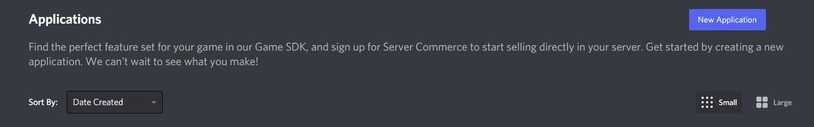
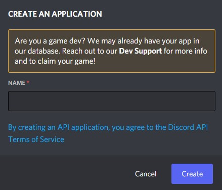
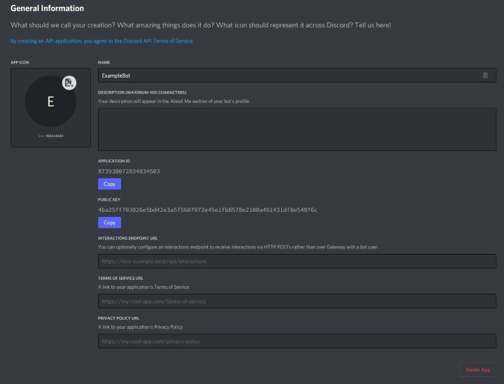
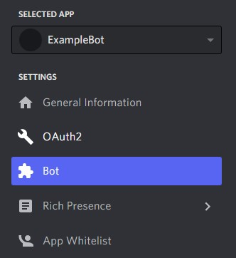
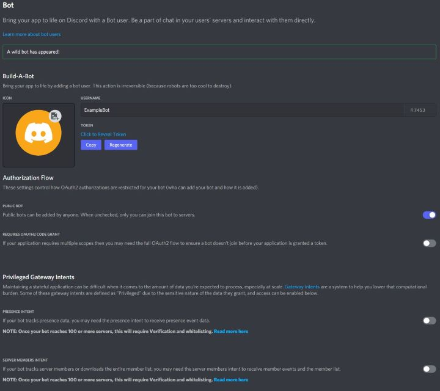
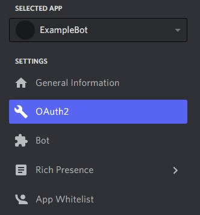
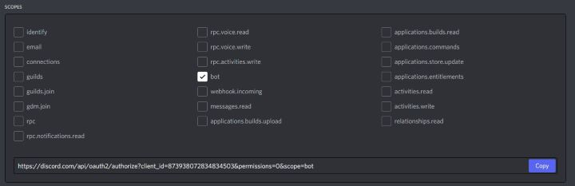
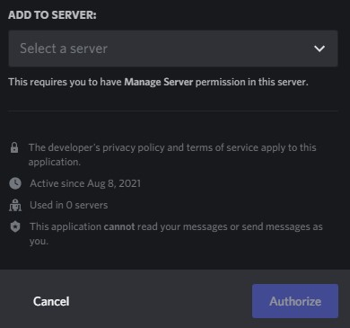

# Ghost Bot

A general purpose Discord bot for managing various Destiny-related tasks.

<br />

---

## Built With & On
* [Node.js](https://nodejs.org/en/download/current) v16.6.1
* [Discord.js](https://discord.js.org/#/) v13.0.1

<br />

---

## Setup

Assuming you have installed Node.js v16.6.1+, run npm install to download dependencies.

```bash
$ npm install

up to date, audited 112 packages in 442ms

19 packages are looking for funding
  run `npm fund` for details

found 0 vulnerabilities
```

Go to [discord.com/developers/application](https://discord.com/developers/applications) and select
New Application to name and create your Discord bot.

<span style="display:block;text-align:center"></span>
<span style="display:block;text-align:center"></span>
<span style="display:block;text-align:center"></span>

On the left menu, select bot and create the Discord bot.

<span style="display:block;text-align:center"></span>
<span style="display:block;text-align:center"></span>

Under TOKEN, click Reveal Token to reveal the Token you'll have to set in your local environment, 
such that process.env.TOKEN will be picked up when running the Discord bot. Next, on the left menu,
navigate to OAuth2 to generate a URL for your new Discord bot. Under scopes, select bot and copy
the generated url. Navigating to this generated URL will allow you to authorize this bot to the
selected Discord server.

__! DO NOT SHARE THIS TOKEN OR CHECK THIS TOKEN INTO VERSION CONTROL !__


<span style="display:block;text-align:center"></span>
<span style="display:block;text-align:center"></span>
<span style="display:block;text-align:center"></span>

At this point, you will be able to see your Discord bot on your server, and you can configure the
roles and channel restrictions for the bot using your own discretion.

Once all this has been done, assuming the TOKEN exists in your processes environment, you can
run everything by navigating to the project's directory and running the following command.

```bash
$ node .
{"message":"Connected!","level":"info"}
{"message":"Logged in as: Sundance#9999", "level":"info"}
```

<br />

---

## Project Structure

```
ghost-bot/
├── readme             # <- documentation
│   ├── images         # <- documentation related images
|
├── index.js           # <- application
├── package.json       # <- project metadata required for operation
├── package-lock.json  # <- project specific dependencies
```

When running the application, logs will be also exported to ./app.log for observation.

<br />

---

## Contributing

1. Fork it
2. Create your feature branch (`git checkout -b my-new-feature`)
3. Commit your changes (`git commit -am 'Added some feature'`)
4. Push to the branch (`git push origin my-new-feature`)
5. Create new Pull Request
